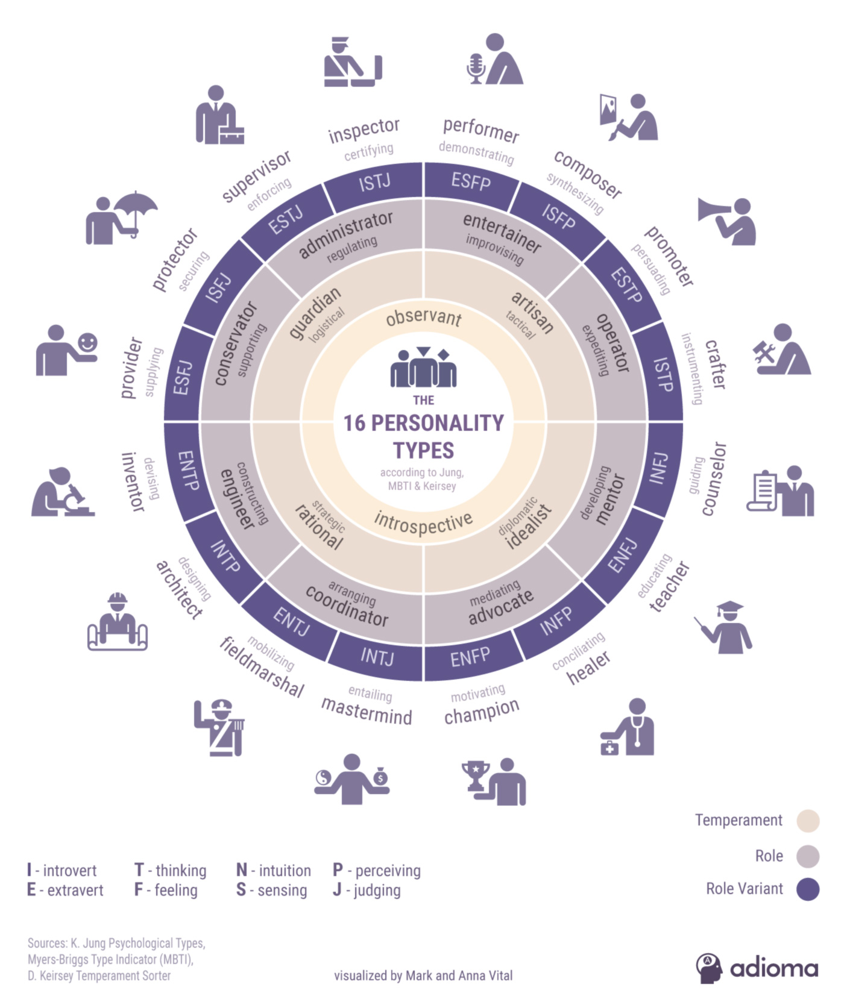
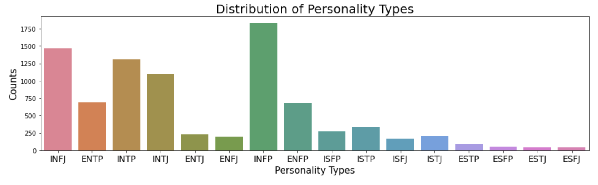
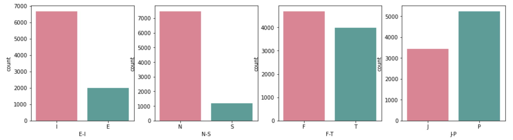
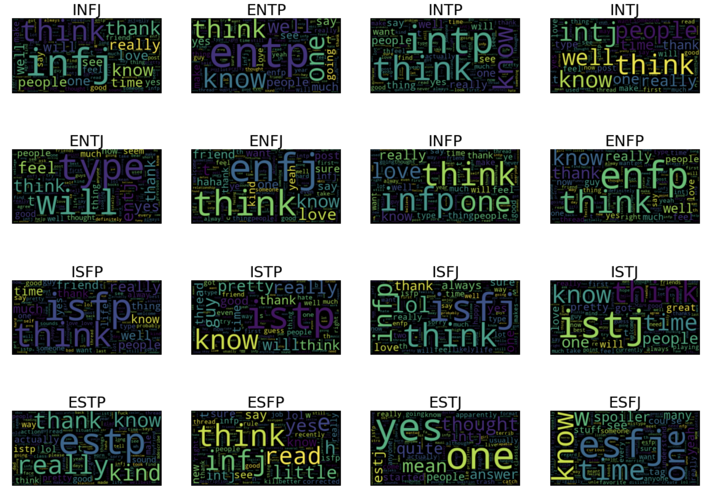
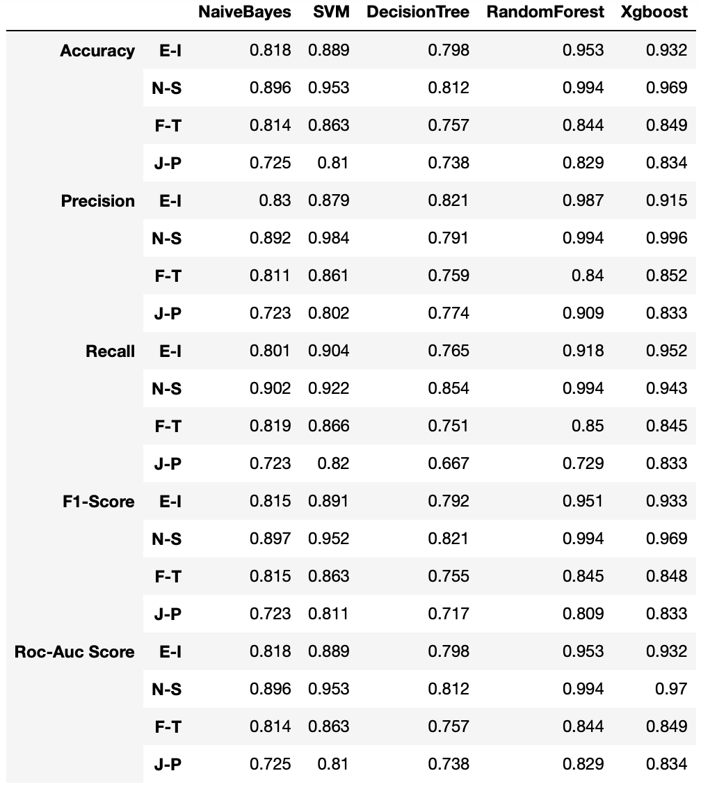
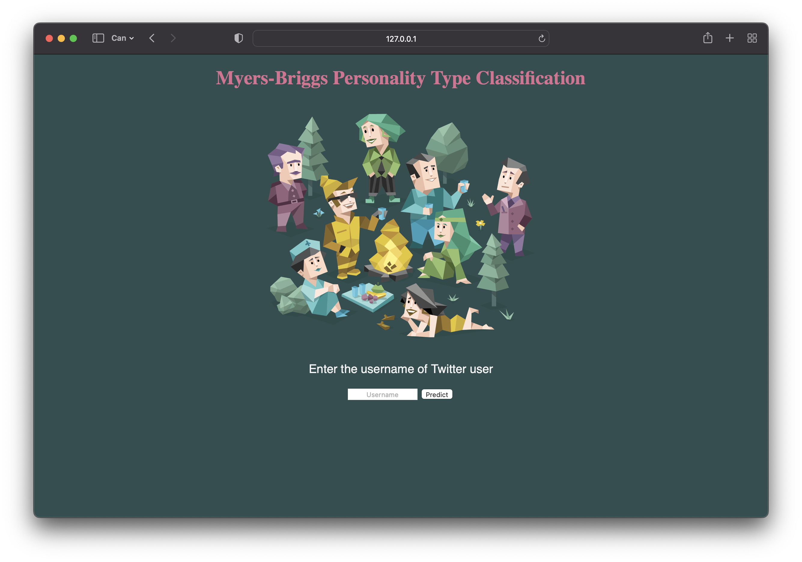
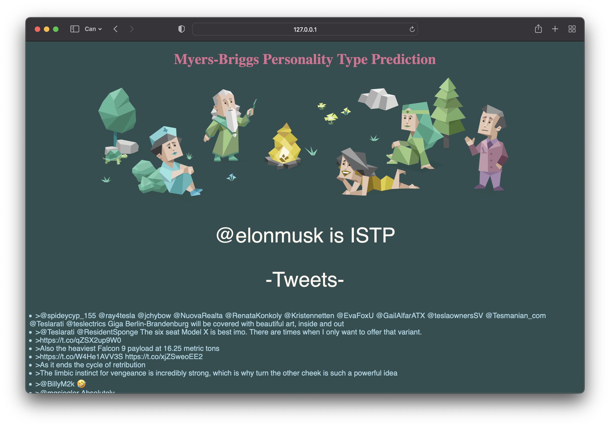

# myers-briggs-tweet-classification

## Motivation of Project

This project shows processes of developing simple Machine Learning models on textual data. With this project users can see the predicted personality types of Twitter users' according to Myers-Briggs Personality Types Indicator. 

This project contains following topics:

    - Exploratory Data Analysis
    - Preprocessing
    - Handling Imbalanced Dataset
    - Vectorization of Text Data
    - Model Creation
    - Model Training
    - Model Evaluation
    - Create basic Website
    - Scrape tweets of Twitter users
    - Prediction of Twitter users personalities

## What is Myers-Briggs Personality Type Indicator?

Myers-Briggs is a personality test that categorizes individuals into one of 16 personality types.
The 16 personality types of the Myers-Briggs arise from four dimensions that consist of two categories each.

    - Extraversion (E) v Introversion (I)
    - Intuition (N) v Sensing (S)
    - Feeling (F) v Thinking (T)
    - Judging (J) v Perceiving (P)

    

## Exploratory Data Analysis

#### Personality Type Distribution

#### Class Distribution

#### WordCloud of Most Frequent Words

## Models' Performance

## Screenshot from Application

### Home Page

### Prediction Page

